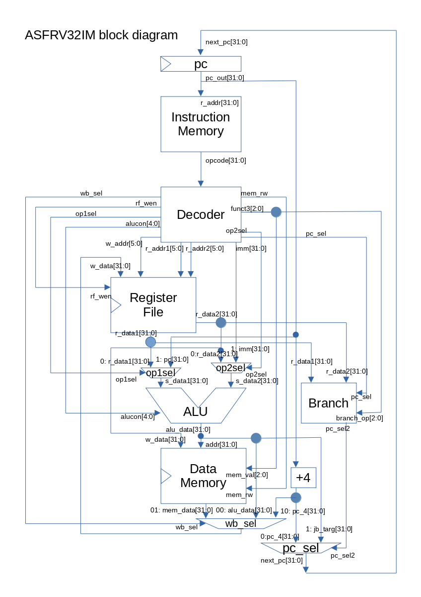

# ASFRV32IM
ASFRV32IM is a small RISC-V RV32IM implementation written with 250 lines for iverilog.
It is compliant with [RISC-V Unpriviledged ISA 20191213](https://riscv.org//wp-content/uploads/2019/12/riscv-spec-20191213.pdf).
It has simple character output function (UART) and program cycle counter
with memory mapped IO, and can run coremark and dhrystone benchmark.

ASFRV32IM is based on [ASFRV32I](https://github.com/asfdrwe/ASFRV32I). 

## LICENSE
  ```
Copyright (c) 2020 asfdrwe <asfdrwe@gmail.com>

Permission is hereby granted, free of charge, to any person obtaining a copy 
of this software and associated documentation files (the "Software"), to deal 
in the Software without restriction, including without limitation the rights 
to use, copy, modify, merge, publish, distribute, sublicense, and/or sell 
copies of the Software, and to permit persons to whom the Software is 
furnished to do so, subject to the following conditions:

The above copyright notice and this permission notice shall be included in 
all copies or substantial portions of the Software.

THE SOFTWARE IS PROVIDED "AS IS", WITHOUT WARRANTY OF ANY KIND, EXPRESS OR 
IMPLIED, INCLUDING BUT NOT LIMITED TO THE WARRANTIES OF MERCHANTABILITY, 
FITNESS FOR A PARTICULAR PURPOSE AND NONINFRINGEMENT. IN NO EVENT SHALL 
THE AUTHORS OR COPYRIGHT HOLDERS BE LIABLE FOR ANY CLAIM, DAMAGES OR OTHER 
LIABILITY, WHETHER IN AN ACTION OF CONTRACT, TORT OR OTHERWISE, ARISING FROM, 
OUT OF OR IN CONNECTION WITH THE SOFTWARE OR THE USE OR OTHER DEALINGS 
IN THE SOFTWARE.
  ```

## Require
- [Icarus Verlog](http://iverilog.icarus.com/)
	- [Windows version](http://bleyer.org/icarus/)
- [gtkwave](http://gtkwave.sourceforge.net/) (optional)

I checked on Linux only.

## Getting started
```
git clone https://github.com/asfdrwe/ASFRV32IM.git
```

## Synthesis
  ```
iverilog -o RV32IM RV32IM.v RV32IM_test.v
iverilog -o RV32IM_coremark RV32IM.v RV32IM_coremark_test.v
  ```
  
## Run as cpu dump mode
  ```
./RV32IM
  ```
## Run as uart mode
  ```
./RV32IM_coremark
  ```

## How to write a program for ASFRV32IM (test.hex)
ASFRV32IM has 64KB memory(instruction and data).
ASFRV32IM runs test.hex which has the opcodes as an 8bit hexadecimal value in each lines, 
so you need risc-v binary to 8bit hexadecimal values.

### Hand assemble
Example "lui x1, 0x20000"
  ```
0b_0010_0000_0000_0000_0000_00001_0110111 (binary)
0x_20_00_00_B7 (hexadecimal)
  ```
Write test.hex as
  ```
B7
00
00
20
  ```
(little endian)

### GCC
You use [RISC-V toolchain](https://github.com/riscv/riscv-gnu-toolchain) .

RETRIEVAL
  ```
$ git clone https://github.com/riscv/riscv-gnu-toolchain
$ cd riscv-gnu-toolchain
$ git submodule update --init --recursive
  ```

BUILD
  ```
$ ./configure --prefix=/opt/riscv
$ make linux
$ export PATH=/opt/riscv/bin:$PATH
  ```

ASFRV32IM is a baremetal.
So you need a linker script such as link.ld because ASFRV32IM's program starts from 0 address. 

[link.ld](mytest/link.ld)
  ```
OUTPUT_ARCH( "riscv" )
ENTRY(_start)

SECTIONS
{
  . = 0x00000000;
  .text : { *(.text) }
  . = ALIGN(0x0100);
  .sbss : { *(.sbss) }
  .bss : { *(.bss) }
  .sdata : { *(.sdata) }
  .data : { *(.data) }
  _end = .;
}
  ```

#### Assembly example
[test1.S](mytest/test1.S)    
  ```
.globl _start

_start:
  li x1, 38233200
  li x2, 3200
  mul  x3, x1, x2
  mulh  x3, x1, x2
_loop:
  jal x0, _loop
  ```

Assemble
  ```
$ riscv64-unknown-elf-gcc -o test1.bin test1.S -march=rv32g -mabi=ilp32 -nostdlib -nostartfiles -T ./link.ld
  ```

You need to convert binary to hex text.
You use objcopy command and [freedom-bin2hex.py](https://github.com/sifive/elf2hex/blob/master/freedom-bin2hex.py) (require python).

  ```
$ riscv64-unknown-elf-objcopy -O binary test1 test1.bin
$ python freedom-bin2hex.py -w 8 test1.bin test.hex
  ```

Run
  ```
$ ./RV32IM
  ```

#### C example 1
You can't use int main() or stdio.h's printf function etc and you set 
stack pointer, so you use the startup routing such as start.S and 
use void \_main() for the main routine instead of int main().

[start.S](mytest/start.S)  
  ```
.globl _start

_start:
  li sp, 0xff00
  jal _main
_loop:
  jal _loop
  ```

[test2.c](mytest/test2.c)
  ```
void _main()
{
  static int a, b, c;
  a = 1;
  b = 2;
  c = 1 + 2;
  int d, e, f, h;
  d = 10;
  e = 15;
  f = e - d;
  h = a - 10;
  return;
}
  ```

Compile
  ```
$ riscv64-unknown-elf-gcc -o test2.bin start.S test2.c -march=rv32g -mabi=ilp32 -nostdlib -nostartfiles -T ./link.ld
  ```

Convert to hexadecimal text
  ```
$ riscv64-unknown-elf-objcopy test2 -O binary test2.bin
$ python freedom-bin2hex.py -w 8 test2.bin test.hex
  ```

Run
  ```
$ ./RV32IM
  ```

#### C example 2
ASFRV32IM has UART output and program cycle counter with memory mapped IO.
You write 1 byte character such as 'a' to 0xfff0, and ASFRV32IM prints 'a'.
You read 4 byte read to 0xfff4, and you get ASFRV32IM's instruction count
from the pragram starting.

I build simple library 'libeelib' with ee\_lib.h.
You use libeelib to write program on ASFRV32IM.
Libeelib has barebones\_clock(retrive cycle count), 
uart\_send\_char(print 1 character like getchar), 
debug\_printf(print a string like printf), 
and strnlen, strlen, strcmp and strcpy.

Libeelib mainly comes from coremark's barebones code. 

[uart\_c.c](mytest/uart_c.c)
  ```
#include "ee_lib.h"

void _main()
{
  uart_send_char('A');
  uart_send_char('\n');
  debug_printf("test\n");
  debug_printf("%d\n", barebones_clock());
  debug_printf("test2\n");
  debug_printf("%d\n", barebones_clock());

  return;
}
  ```

Compile libeelib.a
  ```
$ riscv64-unknown-elf-gcc -c ee_lib.c -O2 -fno-builtin -march=rv32g -mabi=ilp32 -nostdlib -nostartfiles
$ ar rcs libeelib.a ee_lib.o
  ```
Compile uart\_c
  ```
$ riscv64-unknown-elf-gcc -O2 -o uart_c -fno-builtin -march=rv32g -mabi=ilp32 -nostdlib -nostartfiles -T link.ld start.S uart_c.c libeelib.a
  ```

Convert to hexadecimal text
  ```
$ riscv64-unknown-elf-objcopy uart_c -O binary uart_c.bin
$ python freedom-bin2hex.py -w 8 uart_c.bin test.hex
  ```

Run
  ```
$ ./RV32IM_coremark
  ```

Other sample programs are [mytest](mytest/) .

#### riscv-tests
[riscv-tests](https://github.com/riscv/riscv-tests) is a test program set for RISC-V CPU.

  ```
$ git clone https://github.com/riscv/riscv-tests
$ cd riscv-tests
$ git submodule update --init --recursive
$ autoconf
  ```

You need [riscv-tests.patch](riscv-tests.patch) for 0 address startup and removal of CSR code 
(NOTE: ASFRV32IM's ecall acts as jump instruction to 0 address).

```
$ patch -p1 < (ASFRV32IM dir)/riscv-tests.patch
  ```

\*.hex in [test](test/)  are hex format riscv-tests for ASFRV32IM.
\*.dump in [test](test/) are deassembled riscv-tests programs.

BUILD
```
$ make
```

CONVERT (for example, ADD instruction test to hex)
```
$ riscv64-unknown-elf-objcopy -O binary rv32ui-p-add rv32ui-p-add.bin
$ python freedom-bin2hex.py -w 8 rv32ui-p-add.bin rv32ui-p-add.hex .
```

Checking ASFRV32IM with rv32ui-p-add.hex andrv32ui-p-add.dump
```
$ cp rv32ui-p-add.hex.hex test.hex
$ ./RV32IM
```

#### COREMARK
[Coremark](https://github.com/eembc/coremark) is a CPU benchmark mainly 
for embedded system and runs on baremetal environment. 

You need [coremark.patch](coremark.patch) for 0 address startup, uart and cycle count for ASFRV32IM's memory mapped IO.

I tested only 10 iterations.

  ```
$ git clone https://github.com/eembc/coremark.git
$ cd coremark
$ patch -p1 < ../coremark.patch
$ make PORT_DIR=barebones ITERATIONS=10
$ riscv64-unknown-elf-objcopy -O binary coremark.bin tmp.bin
$ python ../freedom-bin2hex.py -w 8 tmp.bin coremark.hex
$ cp coremark.hex ../test.hex
  ```

Run
  ```
$ ./RV32IM_coremark
  ```

RESULT:  
  ```
WARNING: RV32IM.v:11: $readmemh(test.hex): Not enough words in the file for the requested range [0:65535].
INIT
2K performance run parameters for coremark.
CoreMark Size    : 666
Total ticks      : 3083500
Total time (secs): 3083
Iterations/Sec   : 0
Iterations       : 10
Compiler version : GCC10.1.0
Compiler flags   : -O2 -fno-builtin -march=rv32g -mabi=ilp32 -nostdlib -nostartfiles -T barebones/link.ld -DPERFORMANCE_RUN=1  
Memory location  : STACK
seedcrc          : 0xe9f5
[0]crclist       : 0xe714
[0]crcmatrix     : 0x1fd7
[0]crcstate      : 0x8e3a
[0]crcfinal      : 0xfcaf
Correct operation validated. See README.md for run and reporting rules.
FINISH
  ```

ASFRV32IM runs coremark as 1kHz, so ASFRV32IM's COREMARK/MHz is 3.24
(10 iterations / 3083 second * 1000 (1MHz/1kHz) ).

ASFRV32IM is a single cycle CPU, so ASFRV32IM executes all instruction
including multiple/division/reminder
instruction per 1 cycle as same as add instrucion.
It is not reflected from real CPU's execution speed.
Real CPU normally executes division instruction 10-50 times slower than 
add instruction because of division calculation complexity.

ASFRV32IM gains high coremark score, but the score DOES NOT mean ASFRV32IM's
architecture is so fine.

#### DHRYSTONE
[dhrystone](https://github.com/riscv/riscv-tests/tree/master/benchmarks/dhrystone) is a CPU benchmark. 

You need [dhrystone.patch](dhrystone.patch) for 0 address startup, uart, cycle counter and some fixes for ASFRV32IM.

  ```
$ cp -a (riscv-tests dir)/benchmark/dhrystone dhrystone
$ cd dhrystone
$ patch -p1 < ../dhrystone.patch
$ make
$ riscv64-unknown-elf-objcopy -O binary dhrystone dhrystone.bin
$ python ../freedom-bin2hex.py -w 8 dhrystone.bin dhrystone.hex
$ cp dhrystone.hex ../test.hex
  ```

Run
  ```
$ ./RV32IM_coremark
  ```

RESULT:  
  ```
WARNING: RV32IM.v:11: $readmemh(test.hex): Not enough words in the file for the requested range [0:65535].

Dhrystone Benchmark, Version C, Version 2.2
Using barebones_clock(), HZ=1000000

Trying 500 runs through Dhrystone:
Final values of the variables used in the benchmark:

Int_Glob:            5
        should be:   5
Bool_Glob:           1
        should be:   1
Ch_1_Glob:           A
        should be:   A
Ch_2_Glob:           B
        should be:   B
Arr_1_Glob[8]:       7
        should be:   7
Arr_2_Glob[8][7]:    510
        should be:   Number_Of_Runs + 10
Ptr_Glob->
  Ptr_Comp:          65056
        should be:   (implementation-dependent)
  Discr:             0
        should be:   0
  Enum_Comp:         2
        should be:   2
  Int_Comp:          17
        should be:   17
  Str_Comp:          DHRYSTONE PROGRAM, SOME STRING
        should be:   DHRYSTONE PROGRAM, SOME STRING
Next_Ptr_Glob->
  Ptr_Comp:          65056
        should be:   (implementation-dependent), same as above
  Discr:             0
        should be:   0
  Enum_Comp:         1
        should be:   1
  Int_Comp:          18
        should be:   18
  Str_Comp:          DHRYSTONE PROGRAM, SOME STRING
        should be:   DHRYSTONE PROGRAM, SOME STRING
Int_1_Loc:           5
        should be:   5
Int_2_Loc:           13
        should be:   13
Int_3_Loc:           7
        should be:   7
Enum_Loc:            1
        should be:   1
Str_1_Loc:           DHRYSTONE PROGRAM, 1'ST STRING
        should be:   DHRYSTONE PROGRAM, 1'ST STRING
Str_2_Loc:           DHRYSTONE PROGRAM, 2'ND STRING
        should be:   DHRYSTONE PROGRAM, 2'ND STRING

Microseconds for one run through Dhrystone: 542
Dhrystones per Second:                      1844
  ```

ASFRV32IM runs Dhrystones as 1MHz, so ASFRV32IM's DMIPS is 1.0495 (1844 / VAX11/780's score 1757).

## ASFRV32IM Design


## Reference 
- [RISC-V specification](https://riscv.org/technical/specifications/)
